# 🛒 EliteMart - Shopping App
<div align="center">
  
  <br><br>
  
  [](https://android.com)
  [](https://kotlinlang.org)
  [](https://android-arsenal.com/api?level=24)
  
  <br>
  
  **Modern Android shopping app built with Jetpack Compose**
  
</div>

---

## ✨ Features

<div align="center">

| 🛍️ Shopping Experience | 🔐 User Management | 📱 Modern UI |
|:---:|:---:|:---:|
| Browse & purchase products | Secure login/register | Clean Jetpack Compose |

| 🛒 Cart Management | 📦 Order Tracking | 🏠 Address Management |
|:---:|:---:|:---:|
| Add/remove items | Track order history | Multiple delivery addresses |

</div>

## 🛠️ Tech Stack

<div align="center">

| Frontend | Networking | Architecture |
|:---:|:---:|:---:|
| Jetpack Compose | Ktor Client | Clean Architecture |
| Material 3 UI | HTTP/REST APIs | MVVM Pattern |
| Compose Navigation | Kotlin Coroutines | Koin DI |

</div>

## 📱 Screenshots

<div align="center">

### 📲 App Screens Overview

<table>
  <tr>
    <td align="center">
      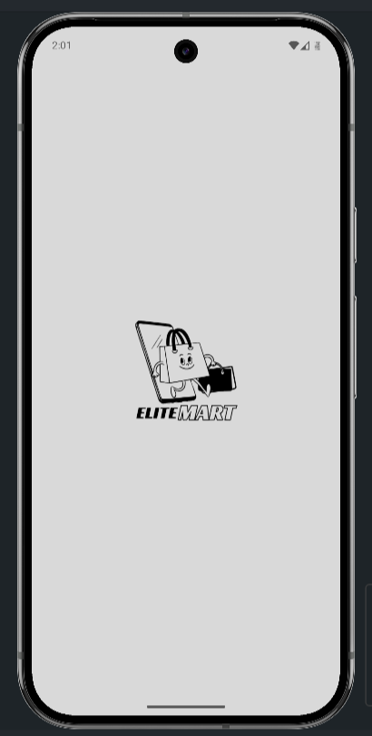
      <br><br>
      <strong>🌟 Splash Screen</strong>
      <br>
      <em>Welcome to EliteMart</em>
    </td>
    <td align="center">
      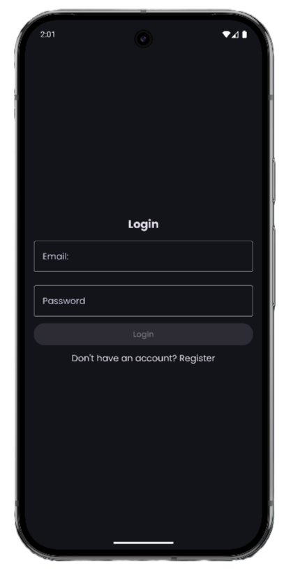
      <br><br>
      <strong>🔐 Login Screen</strong>
      <br>
      <em>Secure authentication</em>
    </td>
    <td align="center">
      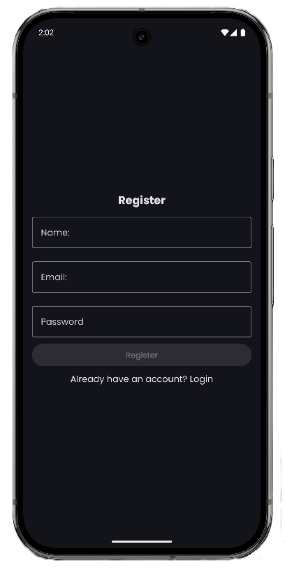
      <br><br>
      <strong>📝 Register Screen</strong>
      <br>
      <em>Quick account setup</em>
    </td>
    <td align="center">
      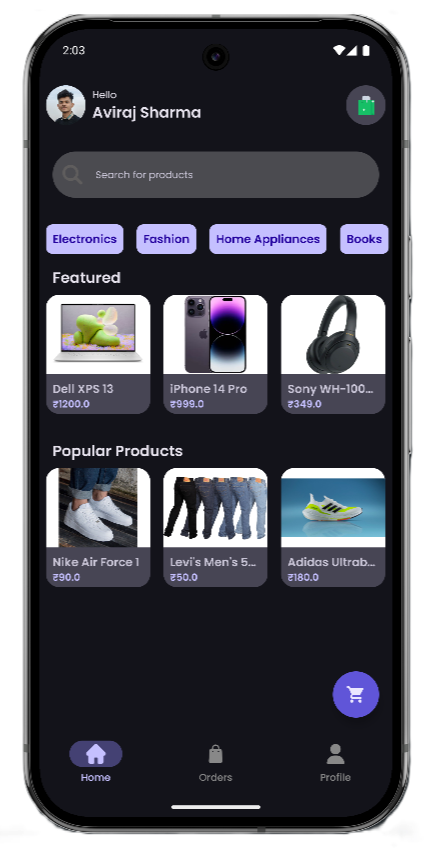
      <br><br>
      <strong>🏠 Home Screen</strong>
      <br>
      <em>Discover products</em>
    </td>
  </tr>
</table>

<br>

<table>
  <tr>
    <td align="center">
      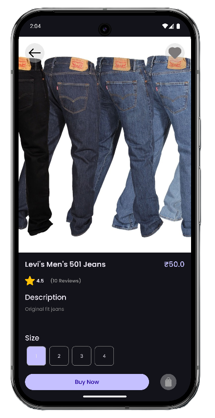
      <br><br>
      <strong>📖 Product Details</strong>
      <br>
      <em>Detailed product info</em>
    </td>
    <td align="center">
      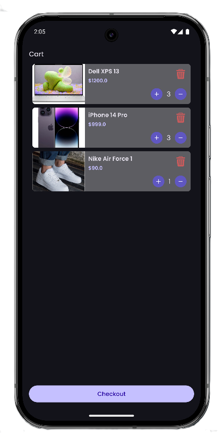
      <br><br>
      <strong>🛒 Shopping Cart</strong>
      <br>
      <em>Manage your items</em>
    </td>
    <td align="center">
      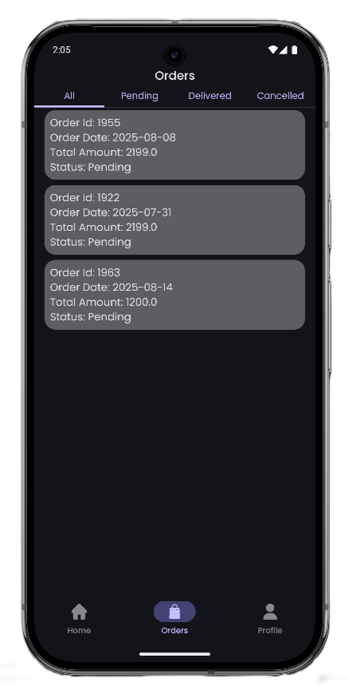
      <br><br>
      <strong>📦 Order History</strong>
      <br>
      <em>Track your purchases</em>
    </td>
    <td align="center">
      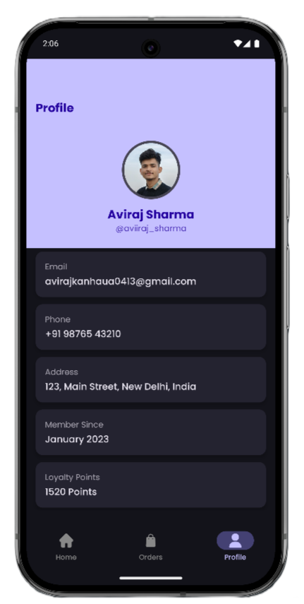
      <br><br>
      <strong>👤 User Profile</strong>
      <br>
      <em>Personal settings</em>
    </td>
  </tr>
</table>

<br>

<table>
  <tr>
    <td align="center">
      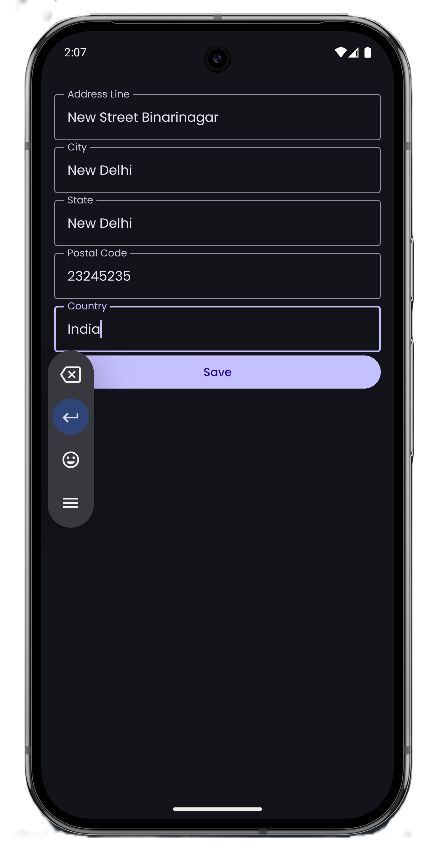
      <br><br>
      <strong>🏠 Address Management</strong>
      <br>
      <em>Delivery addresses</em>
    </td>
    <td align="center">
      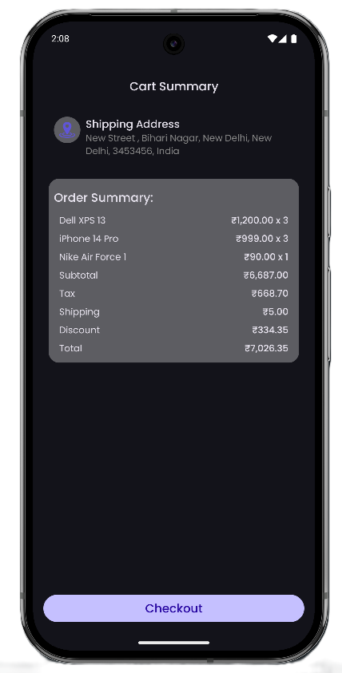
      <br><br>
      <strong>📊 Cart Summary</strong>
      <br>
      <em>Order overview</em>
    </td>
    <td align="center">
      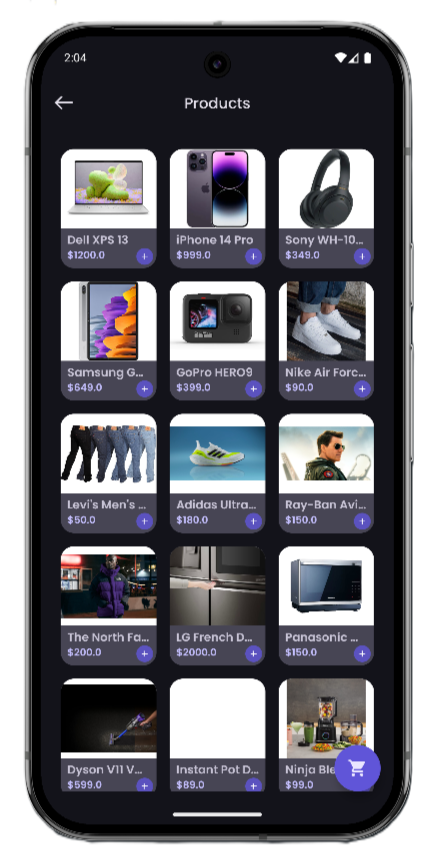
      <br><br>
      <strong>🛍️ All Products</strong>
      <br>
      <em>Complete catalog</em>
    </td>
  </tr>
</table>

</div>

## 🚀 Quick Start Guide

<div align="center">

### 📋 Prerequisites

| Requirement | Version |
|:---:|:---:|
| **Android Studio** | Flamingo+ |
| **Min SDK** | 24 (Android 7.0) |
| **Internet** | Required for API calls |

</div>

### 🔧 Installation Steps

<div align="center">

| Step | Action | Command/Location |
|:---:|:---:|:---:|
| **1** | 📥 **Clone Repository** | `git clone https://github.com/aviirajsharma/EliteMart.git` |
| **2** | 🔧 **Setup Dependencies** | Sync project in Android Studio |
| **3** | 🌐 **Configure API** | Update base URL in network module |
| **4** | ▶️ **Run App** | Build and run on device/emulator |

</div>

## 📁 Project Structure

<div align="center">

```
📦 EliteMart
📂 data/ -----># Repository implementations & API services
📂 domain/-------------------># Business logic & use cases  
📂 presentation/---># ViewModels & UIstate,Compose screens
📂 di/------------------------># Koin dependency injection
📂 utils/-------------------># Helper classes & extensions
```

</div>

## 🏆 Key Highlights

<div align="center">

| 🎯 Clean Architecture | 🚀 Modern Tech Stack | 🎨 Beautiful UI |
|:---:|:---:|:---:|
| MVVM Pattern | Latest Android APIs | Material 3 Design |
| Separation of Concerns | Jetpack Compose | Intuitive Navigation |
| Testable Code | Kotlin Coroutines | Smooth Animations |

</div>

---
<div align="center">
  <br>
  
  ### 🛒 **Made with ❤️ by Aviraj Sharma** 🛍️
  
  <br>
  
  **⭐ Star this repository if you find it helpful! ⭐**
  
  <br>
  
  [](https://github.com/aviirajsharma/EliteMart/stargazers)
  [](https://github.com/aviirajsharma/EliteMart/network/members)
  
</div>
